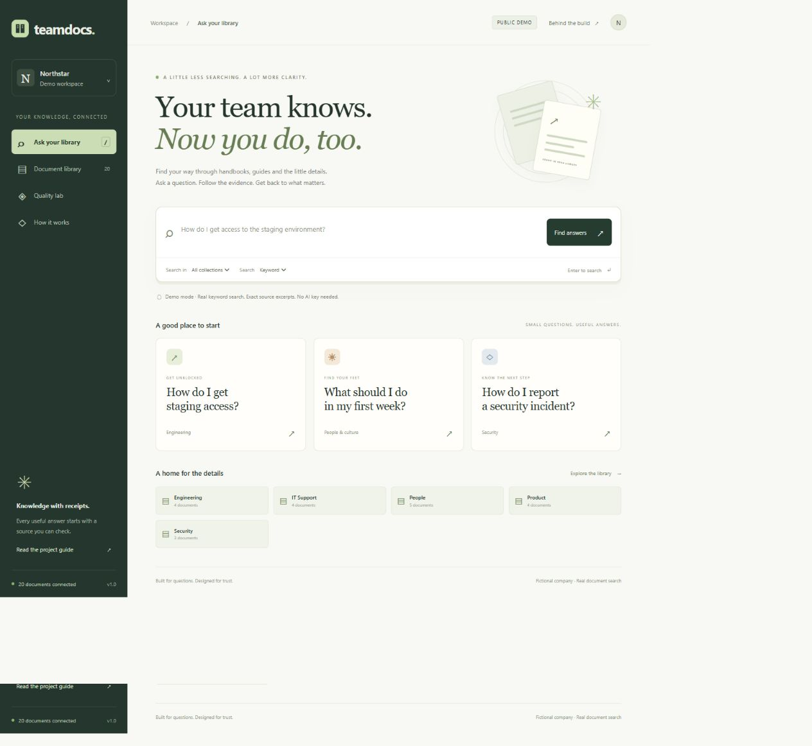

<p align="center"></p>

<h1 align="center">TeamDocs</h1>
<p align="center"><strong>Find the answer. Keep the evidence.</strong><br>A small, thoughtfully built document-search app for the questions teams ask every day.</p>

<p align="center"></p>



**“I just joined the team. How do I get access to staging?”**

The answer is usually somewhere in a handbook, a setup guide, or an old internal note. TeamDocs brings the useful passages together and keeps the original source one click away.

It includes a fictional company library, a source reader, keyword/semantic/hybrid retrieval, an optional AI answer layer, a quality lab, and a complete Sphinx handbook. Designed as a focused junior engineering project: useful enough to demonstrate, small enough to explain.

**Status:** working local demo and deployment configuration. No public deployment URL is claimed. Live AI needs your API key and an embedding build; the delivered validation uses deterministic provider fakes, not paid live calls.

## Explore

[Quick start](#quick-start) · [How it works](#how-it-works) · [Run on Render](#run-on-render) · [Evaluation](#evaluation) · [Interview guide](docs/interview.md)

## What a visitor can do

- Ask a question across 20 original demonstration documents.
- Narrow the search to Engineering, People, Product, Security or IT Support.
- Read source-linked excerpts in demo mode or AI-synthesized claims in live mode.
- Open a cited passage and download its original document.
- Browse and filter the document library.
- See real, reproducible retrieval results in Quality Lab.
- Explore a plain-language “How it works” page and the full project handbook.

### Two honest modes

| | Demo — works immediately | Live AI — opt in |
| --- | --- | --- |
| Search | BM25 keyword search | Keyword, semantic or hybrid |
| Result | Exact sentences from retrieved passages | Structured AI claims linked to passages |
| Credentials | None | Gemini or OpenAI API key |
| Index | Checked-in JSON passages | JSON plus precomputed document embeddings |
| Limitation | Related excerpts may not fully answer the question | Models can still produce unsupported statements |

The demo is not a fake AI response. It performs actual keyword retrieval and labels the output as excerpts. Neither mode equates search scores with confidence.

## How it works


**First, prepare the shelf.** Extract the documents, split them into passages, and preserve their document and section/page addresses. In live mode, also calculate embeddings: numeric representations used to search by meaning.

**Then, answer a question.** Find five relevant passages. Demo mode quotes them; live mode asks an AI model to write supported claims. Validate source IDs and show the reader the evidence.

**One small service delivers everything.** FastAPI serves the interface, search endpoints, public original documents and Sphinx guide. A fixed corpus keeps the Render deployment simple; no database or GPU is required.

Read the [architecture walkthrough](docs/architecture.md) and [design tradeoffs](docs/decisions.md).

## Quick start

Requires **Python 3.12+**. Run these commands inside this project folder.

### Windows PowerShell

```powershell
python -m venv .venv
.\.venv\Scripts\python.exe -m pip install -r requirements-dev.txt
Copy-Item .env.example .env
.\.venv\Scripts\python.exe -m scripts.ingest
.\.venv\Scripts\python.exe -m sphinx -W -b html docs docs/_build/html
.\.venv\Scripts\python.exe -m uvicorn app.main:app --reload
```

### macOS / Linux

```bash
python3 -m venv .venv
source .venv/bin/activate
pip install -r requirements-dev.txt
cp .env.example .env
python -m scripts.ingest
python -m sphinx -W -b html docs docs/_build/html
uvicorn app.main:app --reload
```

Open **http://127.0.0.1:8000**. The Sphinx handbook is at **/guide/**; the interactive API reference is at **/api/docs**. Installation versions are constrained by the checked-in lock file.

Try: “How do I request staging access?”, “How do I report a security incident?”, or “When must I submit an expense claim?”

### Enable live AI

For Gemini, copy `.env.gemini.example` to `.env` and replace the placeholder with your Google AI Studio key. Run `python -m scripts.ingest --embeddings` before starting the server. The template selects live mode, Gemini document embeddings and Gemini answers. Usage is subject to your provider's quota and billing plan. Keys stay on the server and `.env` is ignored by Git. OpenAI is also supported through `.env.example`.

See [complete setup instructions](docs/setup.md). Only public demo documents should be used; the app has no private-document permissions.

## Run on Render

1. Push this folder to your GitHub repository.
2. In Render, create a **Blueprint** connected to that repository.
3. Accept the free service described in `render.yaml` and enter your Gemini API key in Render’s secret field. The Blueprint starts live mode and builds the document embeddings.
4. Once deployed, test a question, citation, document download and `/guide/`.

The configuration installs dependencies, prepares the corpus, builds Sphinx, and starts one FastAPI worker with a `/health` check. The live Blueprint requires a Gemini key; no paid database is needed. To deploy without a key, set `APP_MODE=demo` and remove `--embeddings` from the build command.

Free services can sleep after inactivity. Live AI uses provider quota and may incur charges and requires a different embedding build step. [Deployment guide, live-mode setup and hosting limitations](docs/deployment.md).

## Evaluation

The repository includes **50 synthetic questions**, split into 30 development and 20 designated test cases. Forty are answerable; ten are intentionally unsupported. Some need multiple sources.

```bash
python -m pytest -q
python -m scripts.evaluate --split dev
python -m scripts.evaluate --split test --output evaluation/test-results.json
python -m sphinx -W --keep-going -b html docs docs/_build/html
```

The [checked-in development report](evaluation/results.json) records Hit@5, Recall@5, MRR@5 and all-evidence coverage, including per-question results and a corpus fingerprint. The interface reads that file directly.

**Scope matters:** these metrics measure retrieval on a small author-written corpus. They do not measure live answer correctness, citation support or refusal quality. Use the [human review worksheet](evaluation/human-review.csv) for those. No independent benchmark or production accuracy is claimed.

Automated tests cover citation rejection, category isolation, semantic/hybrid ranking, index freshness, repeatable ingestion, PDF page metadata, source downloads, input limits, feedback, provider failures and prompt/data separation. [Evaluation method and limitations](docs/evaluation.md).

## Project map

```text
app/
  main.py             HTTP routes, input limits, source downloads
  retrieval.py        BM25, cosine similarity, reciprocal-rank fusion
  service.py          Question-to-evidence workflow and citation checks
  provider.py         Small embeddings / Responses API adapter
  static/             Responsive interface, no frontend build tool
data/
  documents/          20 original fictional company documents
  index/              Reproducible passage and document metadata
scripts/
  ingest.py           Markdown/PDF ingestion and optional embedding build
  evaluate.py         Reproducible retrieval evaluation
evaluation/           Questions, measured report and human-review worksheet
tests/                Automated failure-mode and integration checks
docs/                 Sphinx handbook and architecture illustration
render.yaml           One-service deployment blueprint
.github/workflows/    CI: tests, ingestion check, evaluation and docs
```

## Understand it before your interview

Start with the [interview guide](docs/interview.md). It includes a three-minute demo, code-reading order, tradeoff explanations and exercises that make the implementation your own.

Be precise: a valid citation ID is not proof of truth; a category filter is not authorization; a prepared deployment is not a live service; a fake-provider test is not a real-model evaluation.

**AI-assisted development:** this project was created with AI assistance. The owner should study, run, review and extend it, and describe their personal contribution honestly.

## Deliberate boundaries

No login, private uploads, OCR, multi-agent framework, fine-tuning or enterprise security claims. Feedback and rate limits are temporary server memory. This is an enterprise-inspired portfolio prototype with a fixed public collection. [Full limitations](docs/limitations.md).

## Documentation and contributions

Sphinx builds Markdown guides and a Python API reference. To add a feature, include a focused test, update the relevant guide, and explain the user-facing benefit. See [CONTRIBUTING.md](CONTRIBUTING.md).

The code, illustration and fictional documents are original project assets. MIT licensed; dependencies retain their own licenses. [LICENSE](LICENSE).

### Interface languages

Switch between English and French in the top bar. Your choice is saved in the browser. Documents and AI answers stay in their original language; the switch changes interface text only.
