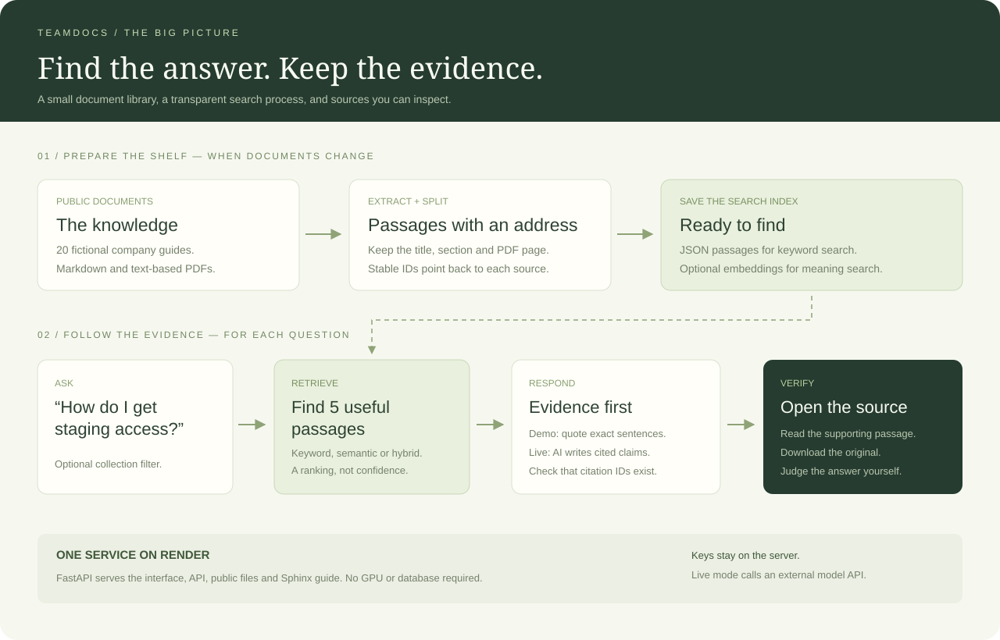

# Architecture, explained

## The plain-language version

A librarian needs an organized shelf before answering questions. TeamDocs does the same: it prepares the documents, searches for useful passages, and lets the reader inspect the evidence.

**Preparation happens when the collection changes.** Question answering happens whenever someone uses the app. Separating them avoids re-reading and re-embedding every document for every question.

## 1. Preparation

`scripts/ingest.py` reads Markdown and text-based PDFs. It splits text within a section or page into windows of up to 180 words, with 30 words of overlap when a section needs multiple windows. This preserves context at a boundary without mixing separate document sections.

Each passage retains:

- A stable identifier such as `staging-access-s1-1`.
- Its parent document and title.
- Its category and section.
- Its original PDF page number, when applicable.
- Its text.

`documents.json` holds the source-file mapping and library information. `chunks.json` holds searchable passages. A source download resolves from this mapping rather than accepting arbitrary file paths from the visitor.

In live mode, a separate step embeds each title, section and passage. It writes a NumPy matrix and metadata containing the embedding model and a hash of the exact ordered chunks. Startup rejects stale embeddings.

## 2. Retrieval

`app/retrieval.py` contains three inspectable methods:

- **BM25:** ranks passages by useful shared words, accounting for word rarity and passage length. It is the no-key baseline.
- **Semantic:** compares the question embedding with passage embeddings using cosine similarity.
- **Hybrid:** merges the two rankings with reciprocal-rank fusion, using `1 / (60 + rank)` with ranks starting at 1. It combines rankings instead of adding incompatible raw scores.

Category filters are applied before selecting the top five passages. The small collection is searched directly in memory. No vector database, approximate nearest-neighbor service or background queue is necessary at this scale.

The demo library has short sections, so its 60 passages do not stress the chunking strategy. A larger, messier corpus is needed before claiming that 180/30 is optimal.

## 3. Answer construction

`app/service.py` coordinates retrieval and presentation. Demo mode selects exact sentences based on shared words. It labels them as excerpts.

Live mode sends the question and retrieved passages to `app/provider.py`. The selected adapter uses Gemini generateContent or OpenAI Responses with a structured JSON answer schema. Gemini uses separate document and query retrieval task types. Index metadata records the provider and model to prevent mixing incompatible vectors. Each claim must contain text and supporting passage IDs. Instructions say to use only supplied evidence, treat documents as untrusted data, and abstain if support is insufficient.

`validate_claims` rejects empty or fabricated citations. It cannot prove that the text of a claim follows from the cited passage. That is why human citation review remains part of evaluation.

## 4. Delivery

FastAPI serves the interface, APIs, original public documents and generated Sphinx guide. The browser receives no API key. Its JavaScript escapes dynamic content and uses a native dialog for source reading.

One Render process loads the read-only corpus. Temporary rate limits, answer IDs and feedback live in bounded memory. They reset on restart and do not coordinate across replicas. Keep the documented one-worker configuration.

## One request, step by step

1. The browser sends a bounded question, category and search method.
2. The server validates input and checks request limits.
3. Semantic/hybrid mode embeds the question; BM25 does not.
4. The index returns five eligible passages.
5. Demo mode quotes evidence; live mode requests structured claims.
6. The server verifies that citation IDs belong to retrieved evidence.
7. The browser displays the result and lets the reader open each original source.

